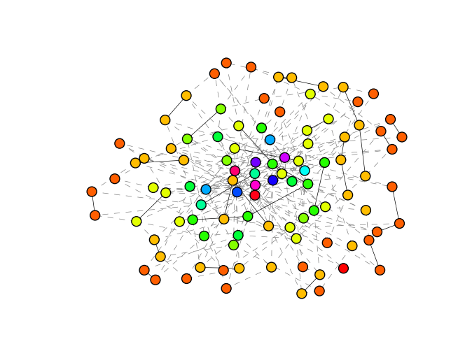
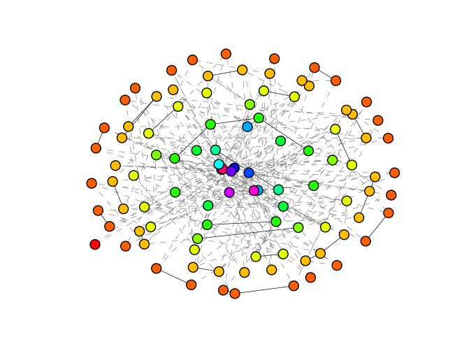

Examples
========

Robustness Comparison
---------------------

.. literalinclude:: ../examples/robustness_comparison.py
   :linenos:

Speed Comparison
----------------

.. literalinclude:: ../examples/speed_comparison.py
   :linenos:

Robustness vs Degree Correlation
--------------------------------

.. literalinclude:: ../examples/r_and_r.py
   :linenos:

Drawing Onion Structure
-----------------------

.. literalinclude:: ../examples/draw_graphs.py
   :linenos:

The results shold be

   ``spring_layout.png``

and

   ``onion_layout.png``

Small Test Code
---------------

This script tests

* 4 types of algorithms
* :class:`~.Optimizer` and :class:`~.TimeTracker`

.. literalinclude:: ../examples/test.py
   :linenos:

